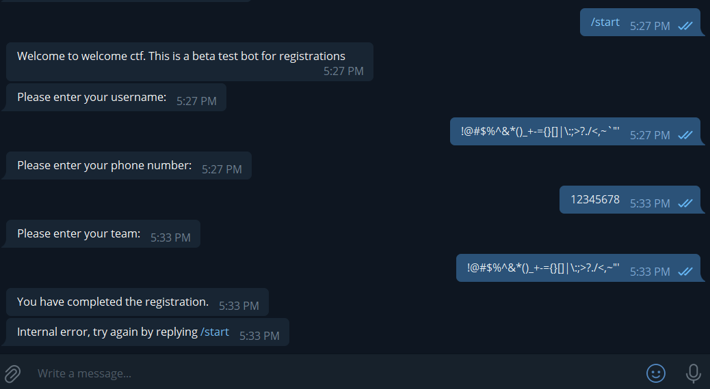
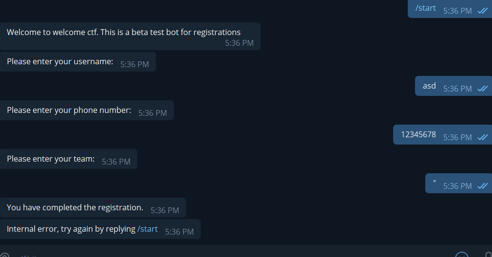

# The Registeration Bot

SQL Injection with a Telegram Bot.

Flag:
 
`greyhats{Th4nk_y0u_f0r_pl4y1ng!}`

## The Happy Run: Normal use

1. The bot seems to ask for player names, a phone number and a team name.
2. There appears to be validation on phone numbers: only numbers are allowed.
3. Any characters seem to be okay for player names and team names.

## Breaking the Bot

1. Try random characters for the Telegram Bot - the idea is to find any characters that may mangle the input. (e.g. `!@#$%^&*()_+-={}[]|\:;>?./<,~"'` for player name and team name)

2. It seems that one of the characters in there has caused an error. Through trial and error, it can be found that the double quote character `"` in the team name field is responsible for the error.

3. This seems to suggest a possible injection avenue in an unknown language.
4. After more trial and error, a SQL-like syntax seems to be injectable into the bot.
5. A `UNION SELECT` SQL injection with one column seems to be the attack to be carried out. Typically, small applications use SQLite as their database backend. Hence, try out a SQL UNION attack targeted at SQLite databases. Use `" UNION SELECT sql from sqlite_master;—`.
6. The stored tables and columns can be retrieved. In particular, the table `flag` with column `flag` seems to be of interest. Use `" UNION SELECT flag from flag;—`

Flag:
 
`greyhats{Th4nk_y0u_f0r_pl4y1ng!}`

